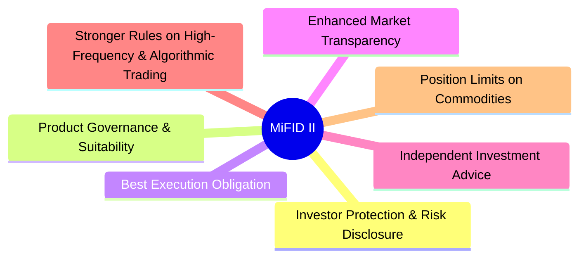
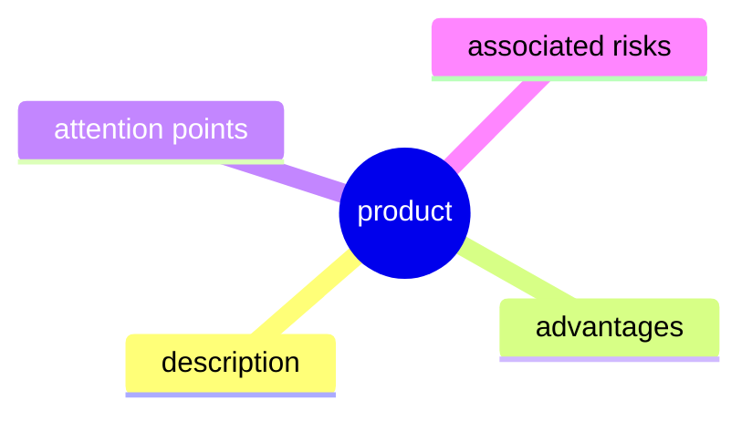
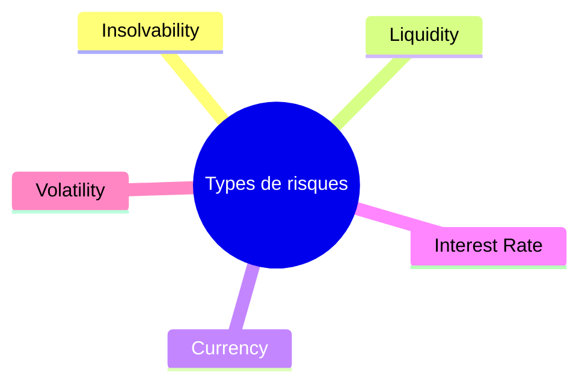
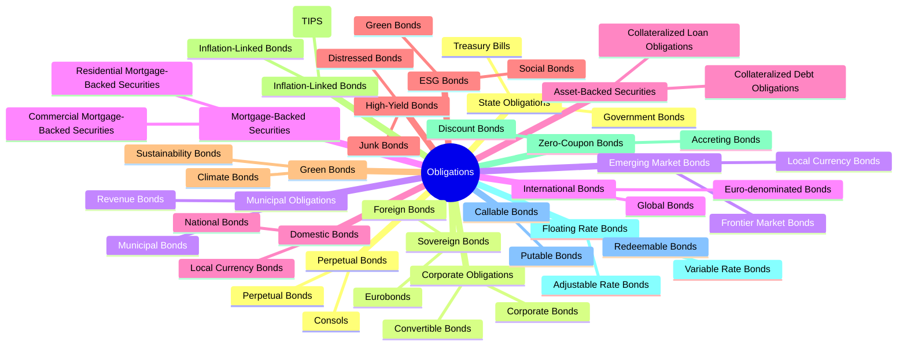
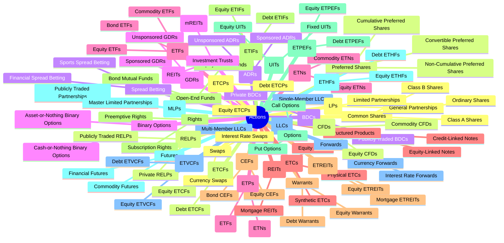
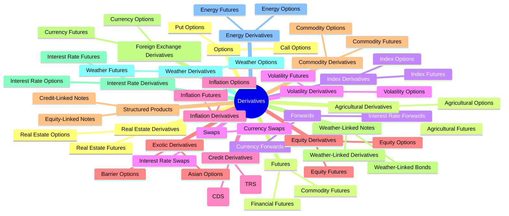

# Investment Products

In this section we will go through the different types of investment products available on the market, their characteristics, advantages and disadvantages, as well as the risks associated with them.

## Introduction

The European Markets in Financial Instruments Directive (MiFID II) is a comprehensive regulatory framework that aims to enhance investor protection and improve the functioning of financial markets in the European Union. It covers a wide range of financial instruments, including stocks, bonds, derivatives, and investment funds.

MiFID II also introduces many new rules and requirements for investment firms that we will not cover in this section:

For each product, we will provide the following information:

## Risks linked to investment products

## Investment products

### A. Fiats

Fiats are the most common form of currency used in everyday transactions. They are issued by governments and central banks and are considered legal tender.

Fiats are not backed by any physical commodity, such as gold or silver, but are instead supported by the trust and confidence of the people who use them.

As an example, the Euro is a fiat currency used in many European countries. It is issued by the European Central Bank (ECB) and is accepted as legal tender in the Eurozone.

### B. Obligations

Obligations are debt securities issued by governments, municipalities, or corporations to raise capital. When you buy an obligation, you are essentially lending money to the issuer in exchange for periodic interest payments and the return of the principal amount at maturity.

Obligations are generally considered lower-risk investments compared to stocks, as they provide a fixed income stream and have a higher claim on assets in the event of bankruptcy.

#### Obligations types

### C. Actions

Actions are equity securities that represent ownership in a company. When you buy shares of a company's stock, you become a partial owner of that company and have a claim on its assets and earnings.

Actions are generally considered higher-risk investments compared to obligations, as their value can fluctuate significantly based on the company's performance and market conditions.

#### Actions types

### D. Derivatives

Derivatives are financial contracts whose value is derived from an underlying asset, index, or rate. They are used for hedging, speculation, and arbitrage purposes.
Derivatives can be traded on exchanges or over-the-counter (OTC) and include options, futures, forwards, and swaps.

#### Derivatives types

