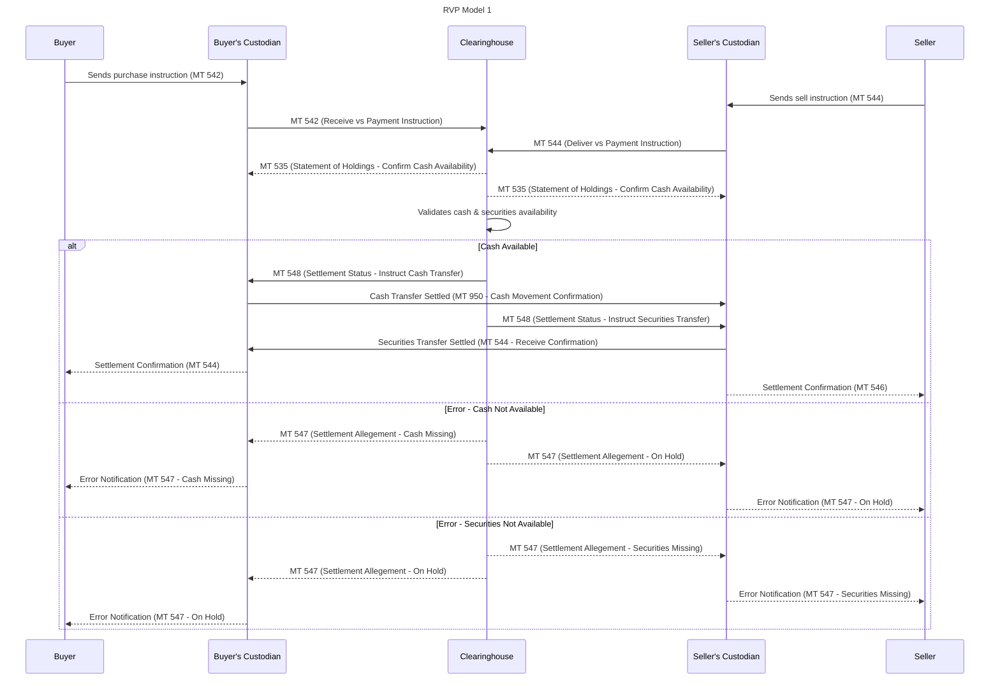

# RVP: Receive Versus Payment Models

## RVP Models

### Model 1

The buyer pays for the securities only when they are received, ensuring that the buyer does not pay for securities that are not delivered.

### Model 2

The seller delivers the securities only when payment is received, ensuring that the seller does not deliver securities without receiving payment.

### Model 3

The transaction is settled in cash rather than through the transfer of securities, typically used for derivatives or futures contracts.

