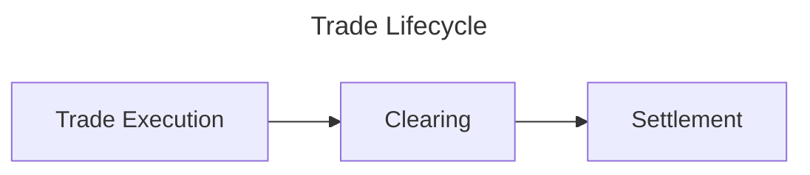

# General Context

## The Trade Lifecycle

Every transaction in finance involves three key steps: trade execution, clearing, and settlement. These steps are crucial for ensuring that transactions are completed accurately and efficiently.

- <u>**Trade Execution:**</u> The first step in a transaction is the trade execution or agreement, where
  two parties agree on the terms of the trade, including the price and quantity of the asset being exchanged.
  This is where the negotiation between the buyer and seller takes place, and the trade is agreed upon.

- <u>**Clearing:**</u> The second step is the clearing process, where the trade is confirmed and the
  details are verified. This step ensures that both parties have the necessary funds or assets to complete
  the transaction.
- <u>**Settlement:**</u> The final step is the settlement process, where the actual transfer of assets
  and cash takes place. This step involves the exchange of securities or assets for cash, completing
  the transaction.

## What is a Settlement for Thirds?

In finance, a settlement for thirds refers to a transaction where a neutral third party (such as a clearinghouse, escrow service, or custodian bank) facilitates the exchange of assets for cash between two parties (e.g., banks, companies). This ensures that each party receives their due payment or asset transfer only when both sides meet their obligations, reducing counterparty risk.

## Who are the Actors involved?

- **Buyer:** The party purchasing the asset or security.
- **Seller:** The party selling the asset or security.
- **Clearinghouse:** A neutral third party that facilitates the transaction, ensuring that both parties meet their obligations.
- **Custodian Bank:** A financial institution that holds and safeguards the assets being exchanged.
- **Escrow Service:** A third-party service that holds funds or assets until the transaction is completed.

## Types of Settlements

- **RVP (Receive Versus Payment):** A settlement method where the buyer pays for the securities only when they are received, ensuring that the buyer does not pay for securities that are not delivered.
- **DVP (Delivery Versus Payment):** A settlement method where the seller delivers the securities only when payment is received, ensuring that the seller does not deliver securities without receiving payment.
- **FOP (Free of Payment):** A settlement method where the securities are transferred without any payment, typically used for internal transfers or between accounts within the same institution.
- **Corporate Actions:** Events that affect the securities, such as dividends, stock splits, or mergers, which may require adjustments to the settlement process.
- **Cash Settlement:** A settlement method where the transaction is settled in cash rather than through the transfer of securities, typically used for derivatives or futures contracts.

## EuroNext

In the context of securities settlement, Euronext is primarily a market operator and a clearinghouse.

Here’s how Euronext fits into different roles:

- 1. Market Operator: Euronext operates the exchange where securities (stocks, bonds, etc.) are bought and sold. As a market operator, Euronext provides the infrastructure for trading, facilitates price discovery, and ensures a fair and transparent marketplace.
- 2. Clearinghouse: Euronext has a clearing arm called Euronext Clearing. In this role, Euronext acts as a central counterparty (CCP), guaranteeing the settlement of transactions. It mitigates risk by interposing itself between buyers and sellers, ensuring that trades are settled even if one party defaults. Euronext Clearing performs the role of a clearinghouse by providing services such as trade matching, netting, and managing the default risk of participants.
- 3. Custodian (Indirectly): While Euronext itself is not a custodian, it works closely with custodians and other financial institutions to ensure the settlement of securities transactions. Custodians hold and safeguard financial assets on behalf of clients, but they often collaborate with clearinghouses (like Euronext Clearing) to facilitate the transfer of securities and funds during settlement.
- 4. Not a Compliance Company: Euronext is not a compliance company. However, it does have rules and regulations that govern market behavior (e.g., market conduct, surveillance, and listing rules). These regulations ensure that trades on the exchange are conducted fairly and in accordance with legal requirements.

In summary, Euronext is a market operator (providing trading infrastructure) and a clearinghouse (ensuring the settlement and risk management of trades).
